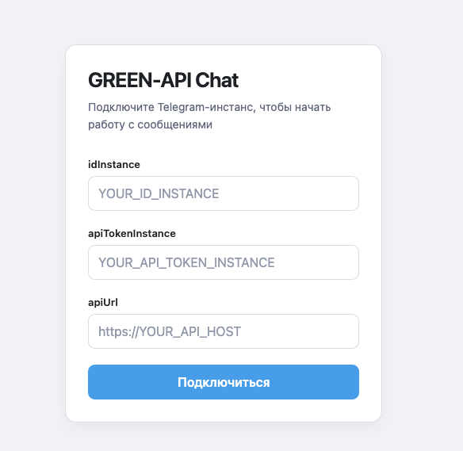
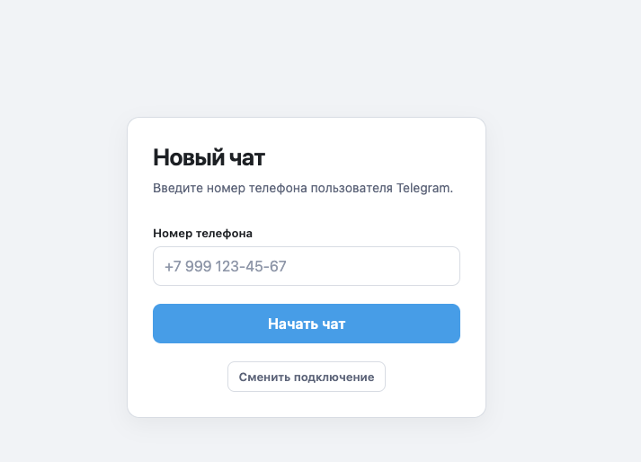

# GREEN-API Telegram Chat

React + TypeScript web-приложение для отправки и получения Telegram-сообщений через GREEN-API.

Проект сделан как frontend-only тестовое задание: пользователь вводит данные GREEN-API instance в браузере, выбирает Telegram-получателя по номеру телефона и работает с простым чатом.

## Деплой

https://green-api-telegram-chat-indol.vercel.app/

## Возможности

- подключение к GREEN-API instance;
- проверка состояния авторизации instance;
- поиск Telegram-пользователя по номеру телефона;
- получение `chatId`;
- отправка текстовых сообщений;
- получение входящих текстовых сообщений через long polling;
- удаление notifications после обработки;
- отображение входящих и исходящих сообщений;
- отображение времени сообщения;
- возврат к выбору нового получателя;
- смена GREEN-API instance без перезагрузки страницы;
- сохранение credentials в `sessionStorage`;
- сохранение выбранного получателя в `localStorage` с привязкой к `idInstance`;
- сохранение локальной истории сообщений отдельно для каждого `idInstance` и `chatId`;
- ограничение локальной истории последними 300 сообщениями на чат.

## Стек

- React
- TypeScript
- Vite
- GREEN-API Telegram API
- Fetch API
- React Hooks
- CSS
- Web Storage API

## Архитектура

Проект оставлен простым, без Redux, React Router, backend и UI-библиотек.

- `src/api` — HTTP-запросы к GREEN-API и базовая проверка ответов.
- `src/hooks` — lifecycle polling для получения notifications.
- `src/pages` — основные UI-экраны приложения.
- `src/types` — TypeScript-типы GREEN-API и доменные типы приложения.
- `src/utils` — небольшие utility-функции для телефона, времени и Web Storage.

## Как работает приложение

1. Пользователь вводит `idInstance`, `apiTokenInstance` и `apiUrl`.
2. Приложение вызывает `GetStateInstance`.
3. Если `stateInstance = authorized`, открывается экран выбора получателя.
4. Пользователь вводит номер телефона Telegram-пользователя.
5. Приложение вызывает `CheckAccount`.
6. Если аккаунт найден, приложение получает `chatId`.
7. Открывается экран чата.
8. Исходящие сообщения отправляются через `SendMessage`.
9. Входящие сообщения получаются через `ReceiveNotification`.
10. Входящие текстовые сообщения из других личных чатов сохраняются в локальную историю соответствующего `chatId`.
11. Каждая notification с валидным `receiptId` удаляется через `DeleteNotification`, чтобы очередь GREEN-API не блокировалась.
12. Если пользователь нажимает `Сменить подключение`, credentials удаляются из `sessionStorage`, polling останавливается, текущий получатель сбрасывается, и приложение возвращается к экрану подключения.

## GREEN-API методы

- `GetStateInstance` — проверяет состояние instance. Приложение продолжает работу только при `authorized`.
- `CheckAccount` — проверяет наличие Telegram-аккаунта по номеру телефона и возвращает `chatId`.
- `SendMessage` — отправляет текстовое сообщение в выбранный чат.
- `ReceiveNotification` — получает следующую notification через long polling.
- `DeleteNotification` — удаляет обработанную notification из очереди GREEN-API. Приложение проверяет JSON-ответ и считает удаление успешным только при `result: true`.

## Требования

- Node.js `20.19+` или `22.12+` для Vite 8
- npm
- активный GREEN-API Telegram instance
- авторизованный Telegram аккаунт в GREEN-API instance

## Настройка GREEN-API

1. Создайте Telegram instance в GREEN-API.
2. Авторизуйте instance.
3. Получите данные подключения:
   - `idInstance`;
   - `apiTokenInstance`;
   - `apiUrl`.
4. В настройках instance включите получение incoming message notifications.
5. Для HTTP polling убедитесь, что поле `webhookUrl` пустое. Если `webhookUrl` заполнен, GREEN-API не позволит получать notifications через `ReceiveNotification`.
6. Убедитесь, что `GetStateInstance` возвращает `stateInstance = authorized`.

Для production-подхода предпочтителен HTTPS `apiUrl`. Приложение принимает корректные `http` и `https` URL, но чувствительные данные не стоит передавать по незащищённому каналу.

Не публикуйте реальные credentials в репозитории. Для примеров используйте только placeholders:

```text
YOUR_ID_INSTANCE
YOUR_API_TOKEN_INSTANCE
https://YOUR_API_HOST
```

## Установка

```bash
git clone https://github.com/RepinDM/green-api-telegram-chat.git
cd green-api-telegram-chat
npm install
npm run dev
```

После запуска Vite выведет локальный URL приложения в терминале.

## Production build

```bash
npm run build
```

Готовая сборка появляется в директории `dist`.

Для локальной проверки production build:

```bash
npm run preview
```

## Использование

1. Откройте приложение.
2. Введите `idInstance`, `apiTokenInstance` и `apiUrl`.
3. Нажмите `Подключиться`.
4. Введите номер телефона Telegram-пользователя.
5. Нажмите `Начать чат`.
6. Отправляйте текстовые сообщения через поле ввода внизу экрана.
7. Оставьте чат открытым, чтобы приложение получало входящие текстовые сообщения через polling.
8. Используйте кнопку назад в header чата, чтобы выбрать другого получателя.
9. Используйте `Сменить подключение`, чтобы удалить текущие credentials из `sessionStorage` и подключить другой instance.

## Хранение данных

- Credentials сохраняются в `sessionStorage` под ключом `green-api-credentials`.
- Выбранный получатель сохраняется в `localStorage` под ключом `green-api-recipient` вместе с `idInstance`.
- История сообщений сохраняется в `localStorage` отдельно для каждого instance и чата под ключом `green-api-messages:<idInstance>:<chatId>`.
- Для каждого чата хранятся последние 300 сообщений.

`apiTokenInstance` не записывается в `localStorage`. Он хранится только в `sessionStorage`, чтобы данные подключения очищались после завершения браузерной сессии.

Если сохранённые данные повреждены, имеют неверный формат или Web Storage недоступен, приложение продолжает работу без падения. Тексты сообщений сохраняются локально в браузере пользователя и не являются серверной историей.

## Polling и notifications

`ReceiveNotification` работает через long polling с одним активным запросом на открытый чат. При размонтировании чата или смене подключения активный запрос и ожидание перед повторной попыткой отменяются через `AbortController`.

Временные ошибки сети и временные ошибки GREEN-API повторяются с задержкой. После нескольких подряд неудачных попыток приложение показывает сообщение пользователю, но продолжает polling. После успешного ответа временная ошибка сбрасывается.

Постоянные ошибки `ReceiveNotification`, например `400`, `401`, `403` или ошибка заполненного `webhookUrl`, останавливают polling до повторного открытия чата или повторного подключения instance.

После получения notification приложение вызывает `DeleteNotification`. Удаление считается успешным только после ответа `result: true`. Временные ошибки удаления повторяются ограниченное количество раз, потому что неудалённая notification может снова оставаться первой в очереди. Постоянная ошибка удаления останавливает polling с понятным сообщением.

## Безопасность

Это frontend-only demo/test assignment. GREEN-API credentials используются браузером напрямую для API-запросов.

Для учебного или тестового frontend-задания такой подход позволяет показать работу с API без backend. В production-архитектуре чувствительные credentials обычно не должны храниться и использоваться в публичном клиентском приложении. Для production лучше добавить backend/proxy слой, который будет держать секреты на сервере и ограничивать доступ клиента к API.

## Ограничения

- поддерживается только Telegram через GREEN-API;
- поддерживаются только текстовые личные сообщения;
- нет работы с группами;
- нет отправки media/files;
- нет редактирования сообщений;
- нет удаления Telegram-сообщений;
- нет полноценного списка диалогов;
- входящие текстовые сообщения других личных чатов сохраняются локально, но не отображаются как список диалогов;
- локальная история в `localStorage` не является серверной синхронизацией истории.

## Что реализовано сверх минимального MVP

- TypeScript-типы для GREEN-API и доменных сущностей;
- отдельный API layer;
- custom hook для long polling;
- cleanup polling через `AbortController`;
- удаление нерелевантных notifications, чтобы очередь не зависала;
- сохранение входящих текстовых сообщений других чатов в историю соответствующего `chatId`;
- защита от дублей входящих сообщений по `idMessage`;
- persistence credentials, recipient и сообщений без смешивания разных instances;
- безопасный `JSON.parse` для Web Storage;
- обработка ошибок записи в Web Storage и переполнения localStorage без падения приложения;
- базовая обработка ошибок API;
- адаптивный минималистичный интерфейс.

## Структура проекта

```text
.
├── index.html
├── package.json
├── package-lock.json
├── README.md
├── eslint.config.js
├── tsconfig.json
├── tsconfig.app.json
├── tsconfig.node.json
├── vite.config.ts
├── public
│   ├── favicon.svg
│   └── icons.svg
└── src
    ├── App.tsx
    ├── main.tsx
    ├── index.css
    ├── api
    │   └── greenApi.ts
    ├── hooks
    │   └── useNotifications.ts
    ├── pages
    │   ├── ChatPage.tsx
    │   ├── CredentialsPage.tsx
    │   └── RecipientPage
    │       └── RecipientPage.tsx
    ├── types
    │   └── greenApi.ts
    └── utils
        ├── formatTime.ts
        ├── normalizePhone.ts
        ├── messageStorage.ts
        └── storage.ts
```

## Команды

- `npm run dev` — запуск Vite dev server.
- `npm run build` — TypeScript build и production сборка через Vite.
- `npm run lint` — проверка ESLint.
- `npm run preview` — локальный preview production build.
- `npm audit` — проверка известных уязвимостей npm-зависимостей. Это стандартная команда npm, она не объявлена в `scripts`.

## Возможные дальнейшие улучшения

- синхронизация истории сообщений с сервером;
- поддержка attachments;
- статусы доставки/прочтения;
- список контактов;
- несколько активных чатов;
- backend proxy для credentials.

## Скриншоты

### Подключение к GREEN-API

На первом экране пользователь вводит данные Telegram-инстанса GREEN-API и подключается к API.



### Выбор получателя

После успешного подключения пользователь вводит номер телефона Telegram-пользователя, с которым хочет начать переписку.


